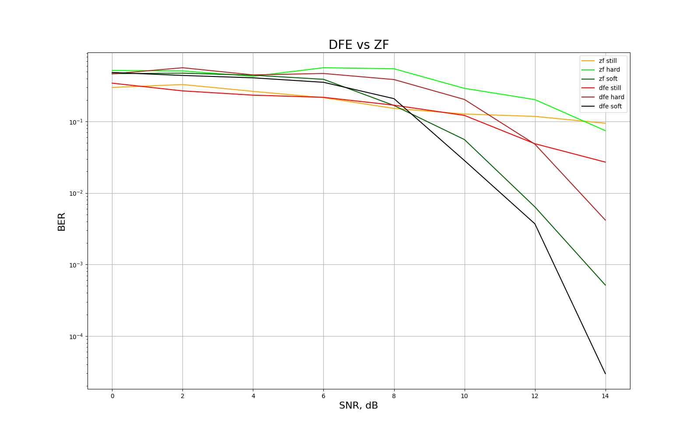

# Decision Feedback Equalizer

Далее в выводе при возникновении членов с отрицательными индексами или с индексами, выходящими за границу допустимой длины, они приравниваются к нулю.

Модулированные символы:

$$
I= \{I_i \}_{i=0}^{N-1};
$$

Импульсная характеристика многолучевого канала:

$$
h=\{h_i \}_{i=0}^{L-1};
$$

Сигнал на выходе из канала:

$$
\nu = h * I + n \quad \Longleftrightarrow \quad \nu_k = \sum\limits_{i=0}^{L-1}h_i \cdot I_{k-i} + n_k. \quad (k - i \geq 0)
$$

Запускаем сигнал на фильтр прямой связи (**Feed-Forward Filter**):

$$
f = w^{ff} * \nu \quad \Longleftrightarrow \quad f_k = \sum\limits_{i=0}^{K_1-1}w^{ff}_i \cdot \nu_{k-i}, \quad (k - i \geq 0)
$$

где $w^{ff}$ - веса фильтра прямой связи, длина фильтра $K_1$.

Для определения фильтра с обратной связью по решению, рассмотрим поподробнее сигнал на выходе из фильтра прямой связи:

$$
\begin{aligned}
    f_k = \sum\limits_{i=0}^{K_1-1}w^{ff}_i \cdot \nu_{k-i} = \sum\limits_{i=0}^{K_1-1}w^{ff}_i \cdot (\sum\limits_{l=0}^{L-1}h_l \cdot I_{k-i-l} + n_{k-i})&= w^{ff}_0h_0I_k + w^{ff}_0h_1I_{k-1} + w^{ff}_0h_2I_{k-2} + \ldots + \\
    &+w^{ff}_1h_0I_{k-1} + w^{ff}_1h_1I_{k-2} + w^{ff}_1h_2I_{k-3} + \ldots + \\
    &+w^{ff}_2h_0I_{k-2} + w^{ff}_2h_1I_{k-3} + w^{ff}_2h_2I_{k-4} + \ldots + \\
    &+\sum\limits_{i=0}^{K_1-1}w^{ff}_i \cdot n_{k-i} = \\
    &= w^{ff}_0h_0I_k + (w^{ff}_0h_1 + w^{ff}_1h_0)\cdot I_{k-1} + \\
    &+ (w^{ff}_0h_2 + w^{ff}_1h_1 + w^{ff}_2h_0) \cdot I_{k-2} + \\
    &+ (w^{ff}_0h_3 + w^{ff}_1h_2 + w^{ff}_2h_1 + w^{ff}_3h_0) \cdot I_{k-3} +\ldots+ \\
    &+\sum\limits_{i=0}^{K_1-1}w^{ff}_i \cdot n_{k-i} = \\
    &=\sum_{i=0}^{(K_1-1) + (L-1)}I_{k-i}\sum_{l=0}^i w^{ff}_lh_{i-l} + \sum_{i=0}^{K_1-1}w^{ff}_i \cdot n_{k-i}
\end{aligned}
$$

Чтобы убрать посткурсоры, понадобится фильтр обратной связи по решению (**Feed-Back Filter**):

$$
b = w^{fb} * \hat{I} \Longleftrightarrow b_k = \sum_{i=0}^{K_2 - 1} w_i^{fb}\hat{I}_{(k-K_1+1) - (i + 1)}
$$

где $\hat{I}_{(k-K_1+1) - (i + 1)}$ - ранее продетектированные символы. Получаем:

$$
y_k = f_k - b_k = \sum_{i=0}^{(K_1 - 1) + (L - 1)}I_{k-i}\sum_{l=0}^{i}w_l^{ff}h_{i-l} + \sum_{i=0}^{K_1-1}w_i^{ff}n_{k-i} - \sum_{i=0}^{K_2 - 1} w_i^{fb}\hat{I}_{(k-K_1+1) - (i + 1)}
$$

Получаем:

$$
y_k = \sum_{i=0}^{K_1 - 1}I_{k-i}\sum_{l=0}^{i}w_l^{ff}h_{i-l} + \sum_{i=K_1}^{(K_1-1) + (L - 1)}I_{k-i}\sum_{l=0}^{i}w_l^{ff}h_{i-l} - \sum_{i=0}^{K_2 - 1} w_i^{fb}\hat{I}_{(k-D+1) - (i + 1)} + \sum_{i=0}^{K_1-1}w_i^{ff}n_{k-i}
$$

Пусть:

$$
g_i = \sum_{l=0}^{i}w_l^{ff}h_{i-l}
$$

Тогда действие фильтра обратной связи по решению можно переписать следующим образом:

$$
\sum_{i=K_1}^{(K_1 - 1) + (L - 1)}I_{k-i}g_i - \sum_{i=0}^{K_2 - 1} w_i^{fb}\hat{I}_{(k-K_1+1) - (i + 1)} =
$$

$$
= \sum_{i=0}^{L - 2}I_{k-(i+K_1)}g_{K_1 + i} - \sum_{i=0}^{K_2 - 1} w_i^{fb}\hat{I}_{(k-K_1+1) - (i + 1)} =
\sum_{i=0}^{L - 2}I_{k-(i+K_1)}g_{K_1 + i} - \sum_{i=0}^{K_2 - 1} w_i^{fb}\hat{I}_{k - (i+K_1)}
$$

Откуда следует:

$$
K_2 = L - 1; \quad w_i^{fb} = g_{K_1 + i} = \sum_{l=0}^{K_1 - 1}w_l^{ff}h_{K_1 + i-l} \quad (i \leq K_1-2)
$$

При условии правильности ранее продетектированных символов, получаем:

$$
y_k = \sum_{i=0}^{K_1 - 1}I_{k-i}\sum_{l=0}^{i}w_l^{ff}h_{i-l} + \sum_{i=0}^{K_1-1}w_i^{ff}n_{k-i}
$$

Введём такое понятие как задержка символа величиной $D - 1$:

$$
\hat{I}_{k-D+1} \Longleftrightarrow y_k
$$

Разобрались с длинами фильтров. Осталось определить веса фильтра прямой связи и задача будет решена. Для этого введём функцию стоимости ошибки **MSE**:

$$
J = \mathbb{E} [|I_{k-D+1} - y_k|^2]
$$

Условие минимума данной функции **MMSE**:

$$
\nabla J = \frac{\partial J}{\partial \vec{w}^{ff}} = 0
$$

Распишем $J$:

$$
J = \mathbb{E}[|I_{k-D+1} - \sum_{i=0}^{K_1 - 1}I_{k-i}g_i + \tilde{n}_k|^2].
$$

Из условия некоррелированности исходных символов:

$$
J = \sum_{\begin{gathered}i=0 \\ i \neq D-1\end{gathered}}^{K_1-1}|I_{k-i}|^2|g_i|^2 + |I_{k-D+1}|^2 \cdot |1-g_{D-1}|^2 + \mathbb{E}[|\tilde{n}_k|^2] =
$$

$$
= \sigma^2_I\sum_{\begin{gathered}i=0 \\ i \neq D-1\end{gathered}}^{K_1-1}|g_i|^2 + \sigma^2_I|1-g_{D-1}|^2 + \sigma^2_n\sum_{i=0}^{K_1-1}|w_i^{ff}|^2
$$

С учётом нормировки исходных символов: $\sigma^2_I = 1$:

$$
J = \sum_{\begin{gathered}i=0 \\ i \neq D-1\end{gathered}}^{K_1-1}\left|\sum_{m=0}^iw_m^{ff}h_{i-m}\right|^2 + |1-\sum_{m=0}^{D-1}w_m^{ff}h_{D-1-m}|^2 + \sigma^2_n\sum_{i=0}^{K_1-1}|w_i^{ff}|^2
$$

Найдём $n$-ую ($n \leq D-1$) производную функции стоимости $J$:

$$
\frac{\partial J}{\partial w_n^{ff}} = 2\sum_{\begin{gathered}i=n \\ i \neq D-1\end{gathered}}^{K_1-1}\left(\sum_{m=0}^iw_m^{ff}h_{i-m}\right)h_{i-n} + 2\left(1-\sum_{m=0}^{D-1}w_m^{ff}h_{D-1-m}\right)(-h_{D-1-n}) + 2\sigma^2_nw_n^{ff} = 0
$$

Раскрыв скобки, получаем:

$$
\sum_{\begin{gathered}i=n \\ i \neq D-1\end{gathered}}^{K_1-1}\left(\sum_{m=0}^iw_m^{ff}h_{i-m}\right)h_{i-n} + h_{D-1-n}\sum_{m=0}^{D-1}w_m^{ff}h_{D-1-m} + \sigma^2_nw_n^{ff} = h_{D-1-n}
$$

Объединяя обе суммы:

$$
\sum_{i=n}^{K_1-1}\left(\sum_{m=0}^iw_m^{ff}h_{i-m}\right)h_{i-n} + \sigma^2_nw_n^{ff} = h_{D-1-n}
$$

Данное выражение мы бы получили и при производной $n > D-1$, но левая часть приравнивалась бы к нулю. В любом случае, в начале мы определили, что все члены с отрицательными индексами равны нулю, поэтому
при данной записи, противоречий в любом случае не будет.

Рассмотрим первую сумму:

$$
\begin{aligned}
\sum_{i=n}^{K_1-1}\left(\sum_{m=0}^iw_m^{ff}h_{i-m}\right)h_{i-n} &=\sum_{m=0}^nw_m^{ff}h_{n-m}h_0 \\
&+\sum_{m=0}^nw_m^{ff}h_{n+1-m}h_1 + w_{n+1}^{ff}h_0h_1 +\\
&+\sum_{m=0}^nw_m^{ff}h_{n+2-m}h_2 + w_{n+1}^{ff}h_1h_2 + w_{n+2}^{ff}h_0h_2 +\\
& \ldots \\
&+\sum_{m=0}^nw_m^{ff}h_{K_1-1-m}h_{K_1-1-n} + w_{n+1}^{ff}h_{K_1-1-(n+1)}h_{K_1-1-n} + w_{n+2}^{ff}h_{K_1-1-(n+2)}h_{K_1-1-n} + \ldots = \\
&=\sum_{m=0}^nw_m^{ff}\left( \sum_{i=n}^{K_1-1}h_{i-m}h_{i-n} \right) + \sum_{m=n+1}^{K_1-1}w_m^{ff}\left( \sum_{i=m}^{K_1-1}h_{i-m}h_{i-n} \right)
\end{aligned}
$$

В итоге получаем:

$$
\sum_{m=0}^nw_m^{ff}\left( \sigma^2_n \delta_{mn} + \sum_{i=n}^{K_1-1}h_{i-m}h_{i-n} \right) + \sum_{m=n+1}^{K_1-1}w_m^{ff}\left( \sum_{i=m}^{K_1-1}h_{i-m}h_{i-n} \right) = h_{D-1-n}
$$

Собираем получившуюся СЛАУ в матричное уравнение:

$$
(\mathbf{R} + \sigma^2_n \mathbf{I}) \cdot \vec{w}^{ff} = \vec{p}
$$

Разберём её составляющие по порядку:

$$
\mathbf{R} = \left( \sum_{i = \max(m , \ n)}^{K_1-1} h_{i-m}h_{i-n} \right)_{\begin{gathered} 0 \leq n \leq K_1-1 \\ 0 \leq m \leq K_1-1 \end{gathered}}; \quad \vec{w}^{ff} = \left(w_0^{ff}, \ldots, w_{K_1-1}^{ff}\right)^T; \quad \vec{p} = \left(h_{D-1}, \ldots, h_{D-K_1}\right)^T;
$$

Тогда вектор весов фильтра прямой связи:

$$
\vec{w}^{ff} = (\mathbf{R} + \sigma^2_n \mathbf{I})^{-1} \cdot \vec{p}
$$

Заметим, что матрицу $\mathbf{R}$ можно разложить через разложение Халецкого:

$$
\mathbf{R} = \mathbf{H}^T \cdot \mathbf{H}
$$

где $\mathbf{H}$ - свёрточная матрица канала:

$$
\mathbf{H} = \begin{pmatrix}
h_0 & 0 & \cdots & 0 \\
h_1 & h_0 & \cdots & 0 \\
\vdots & \vdots & \ddots & \vdots \\
h_{K_1-1} & h_{K_1-2} & \cdots & h_{0}
\end{pmatrix}
$$

Из данного разложения следует симметричность и положительно определённость матрицы $\mathbf{R}$, что доказывает существование матрицы $(\mathbf{R} + \sigma^2_n \mathbf{I})^{-1}$.

Используя модифицированную свёрточную матрицу, мы можем определить вектор весов фильтра обратной связи по решению:

$$
\vec{w}^{fb} = \mathbf{H}_{modif}^T \cdot \vec{w}^{ff}_{sl} = \begin{pmatrix}
h_{K_1} & h_{K_1-1} & \cdots & h_1 \\
0 & h_{K_1} & \cdots & h_2 \\
\vdots & \vdots & \ddots & \vdots \\
0 & 0 & \cdots & h_{K_1}
\end{pmatrix} \cdot \begin{pmatrix}
w^{ff}_0 \\
w^{ff}_1 \\
\vdots \\
w^{ff}_{K_1-1}
\end{pmatrix}
$$

При условии правильности ранее продетектированных символов, получаем:

$$
y_k = \sum_{i=0}^{K_1 - 1}I_{k-i}\sum_{l=0}^{i}w_l^{ff}h_{i-l} + \sum_{i=0}^{K_1-1}w_i^{ff}n_{k-i}
$$

Для определения длины фильтра прямой связи, рассмотрим случай $i=K_1-1$:

$$
I_{k - (K_1-1)} (w_0^{ff}h_{K_1-1} + \ldots + w_{K_1-1}^{ff}h_0)
$$

Отсюда видно, что если взять $K_1 < L$, то мы получим не всю информацию о канале, при $K_1>L$, мы получаем избыточную информацию. Для начала, возьмём минимально возможную длину $K_1=L$.

Введём такое понятие как задержка символа величиной $D - 1$:

$$
\hat{I}_{k-D+1} \Longleftrightarrow y_k
$$

С учётом прошлый размышлений, полную информацию о канале на $y_k$ пришедшем символе будет нести символ $I_{k - (L-1)}$, откуда можно получить оптимальную задержку определения символа $D=L$. Также из прошлых размышлений следует $D=L=K_1=K_2+1$.

При помощи метрики **BER** сравним работу **DFE** и линейного эквалайзера **ZF** (Zero-Forcing).
Для этого определим его веса:

$$
\sum_{i=0}^{(K_1-1) + (L-1)}I_{k-i}\sum_{l=0}^i w^{zf}_lh_{i-l} = I_k \quad \Longleftrightarrow \quad \mathbf{H} \cdot \vec{w}^{zf} = \vec{\delta}; \quad \vec{\delta} = \left(1, 0, \ldots, 0\right)^T;
$$

Получаем следующий результат:
